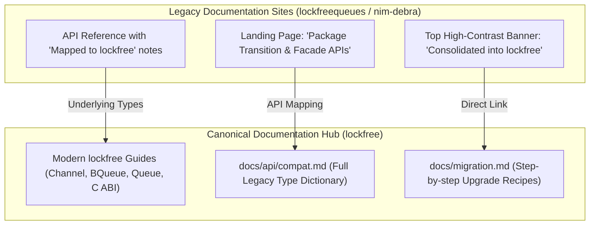

# Ecosystem Transition Plan: `lockfreequeues` & `nim-debra` → `lockfree`

## 1. Executive Summary

As part of the **v0.1.0 Umbrella Consolidation**, the standalone libraries `lockfreequeues` and `nim-debra` are consolidated into a single unified package: **`lockfree`**.

To prevent breaking existing downstream adopters and Nimble package consumers, `lockfreequeues` and `nim-debra` will not be abruptly abandoned or hard-deleted. Instead, they transition through a **Two-Stage Facade Architecture**:
1. **The Repositories Become Thin Zero-Overhead Forwarding Shims**: They depend on `lockfree >= 0.1.0` and re-export the consolidated modules.
2. **The Documentation Sites Become Guided Landing Hubs**: Instead of confusing users with blind 301 redirects, the legacy doc sites display a prominent migration banner, an API mapping dictionary, and direct deep-links to the canonical `lockfree` documentation.

---

## 2. Package Architecture & Release Strategy

### A. `lockfreequeues` (v5.1.0 / v6.0.0 Release)

In the `lockfreequeues` repository:
- **`lockfreequeues.nimble`**:
  ```nim
  version       = "5.1.0"
  author        = "Elijah Rivers"
  description   = "Compatibility facade for lockfree - lock-free queues for Nim"
  license       = "MIT"
  srcDir        = "src"

  requires "nim >= 2.2.10"
  requires "lockfree >= 0.1.0"
  ```
- **`src/lockfreequeues.nim`**:
  ```nim
  ## Backwards-compatibility facade.
  ## Re-exports the unified lockfree compatibility layer.
  import lockfree/compat/lockfreequeues
  export lockfreequeues
  ```
- **Result**: Any user running `nimble install lockfreequeues` or having `requires "lockfreequeues"` in their `.nimble` continues to compile with zero code changes, while transparently benefiting from the hardened `lockfree` engine and bugfixes.

### B. `nim-debra` (v0.11.0 / v1.0.0 Release)

In the `nim-debra` repository:
- **`debra.nimble`**:
  ```nim
  version       = "0.11.0"
  author        = "Elijah Rivers"
  description   = "Compatibility facade for lockfree/smr/nebr - DEBRA+ memory reclamation"
  license       = "MIT"
  srcDir        = "src"

  requires "nim >= 2.2.10"
  requires "lockfree >= 0.1.0"
  ```
- **`src/debra.nim`**:
  ```nim
  ## Backwards-compatibility facade.
  ## Re-exports NEBR from lockfree.
  import lockfree/smr/nebr
  export nebr
  ```
- **Result**: Any caller depending on `debra` gets the latest NEBR implementation (including `unregisterThread`, Apple Silicon cacheline tuning, and bugfixes) automatically.

---

## 3. Documentation Strategy: Why NOT Blind Hard Redirects?

A common anti-pattern in package consolidation is setting an immediate blind HTTP 301 redirect from `https://elijahr.github.io/lockfreequeues/` to `https://elijahr.github.io/lockfree/`.

### Why Blind Redirects Fail Users:
1. **Broken Deep Links**: A developer searching Google or GitHub for `MupmucProducer.push` or `DebraManager.registerThread` lands on `lockfree`'s front page, which explains `BQueue` and `Channel[T]`. The developer cannot find their method, assumes the library removed their feature, and files an issue or abandons the project.
2. **Context Loss**: Legacy codebases cannot immediately rewrite their types. They need to see the exact signature of the facade types they are currently calling.

### The Recommended 3-Tier Transition Pattern:



1. **Persistent Top Banner (on MkDocs sites)**:
   Add to `mkdocs.yml` on both legacy repos:
   ```yaml
   extra:
     banner:
       content: >
         ⚠️ <strong>Package Consolidated:</strong> This library is now maintained as a zero-overhead compatibility facade over 
         <a href="https://elijahr.github.io/lockfree/"><strong>lockfree</strong></a>.
         See the <a href="https://elijahr.github.io/lockfree/migration/">Migration Guide</a>.
   ```
2. **Dedicated Facade Reference Page**:
   The index page of both legacy documentation sites explains:
   - What the package is today (a maintained compatibility wrapper).
   - The exact list of APIs it exports.
   - A side-by-side mapping table showing the modern `lockfree` equivalent.
   - Recommended timeline: new projects should install `lockfree` directly; existing projects can migrate at leisure.

---

## 4. Facade API Mapping Dictionary

### A. `lockfreequeues` Facade Surface

| Legacy Alias | Modern `lockfree` Underlying Type | Recommended Migration Path |
| :--- | :--- | :--- |
| `Sipsic[N, T]` | `BQueue[T, ccSingle, ccSingle, N, 0, 0]` | `newSpscQueue[T, N]()` |
| `Mupsic[N, P, T]` | `BQueue[T, ccMulti, ccSingle, N, P, 0]` | `newMpscQueue[T, N, P]()` |
| `Sipmuc[N, C, T]` | `BQueue[T, ccSingle, ccMulti, N, 0, C]` | `newSpmcQueue[T, N, C]()` |
| `Mupmuc[N, P, C, T]` | `BQueue[T, ccMulti, ccMulti, N, P, C]` | `newMpmcQueue[T, N, P, C]()` |
| `UnboundedSipsic[T, ST, S]` | `Queue[T, ccSingle, ccSingle, ST, S, 1]` | `newUnboundedSpscQueue[T, S]()` |
| `UnboundedMupsic[T, ST, S, M]` | `Queue[T, ccMulti, ccSingle, ST, S, M]` | `newUnboundedMpscQueue[T, S, M]()` |
| `UnboundedSipmuc[T, ST, S, M]` | `Queue[T, ccSingle, ccMulti, ST, S, M]` | `newUnboundedSpmcQueue[T, S, M]()` |
| `UnboundedMupmuc[T, ST, S, M]` | `Queue[T, ccMulti, ccMulti, ST, S, M]` | `newUnboundedMpmcQueue[T, S, M]()` |
| `MupmucProducer[N, P, C, T]` | `Bound[T, AnyThreadTag, BQueue[...]]` | `queue.getProducer()` |
| `MupmucConsumer[N, P, C, T]` | `Bound[T, AnyThreadTag, BQueue[...]]` | `queue.getConsumer()` |

### B. `nim-debra` Facade Surface

| Legacy DEBRA Symbol | Modern `lockfree` Symbol | Module |
| :--- | :--- | :--- |
| `DebraManager[MaxThreads, CC]` | `DebraManager[MaxThreads, CC]` | `lockfree/smr/nebr` |
| `ThreadHandle[MaxThreads, CC]` | `ThreadHandle[MaxThreads, CC]` | `lockfree/smr/nebr` |
| `registerThread(manager)` | `registerThread(manager)` | `lockfree/smr/nebr` |
| `unregisterThread(handle)` | `unregisterThread(handle)` | `lockfree/smr/nebr` |
| `withPin(handle, body)` | `withPin(handle, body)` | `lockfree/smr/nebr` |
| `retireNode(handle, ptr)` | `retireNode(handle, ptr)` | `lockfree/smr/nebr` |
| `reclaimNow(handle)` | `reclaimNow(handle)` | `lockfree/smr/nebr` |
| `neutralizeStalled(...)` | `neutralizeStalled(...)` | `lockfree/smr/nebr` |

---

## 5. Execution Checklist for Legacy Repositories

When publishing the consolidation releases:

- [ ] **`elijahr/lockfreequeues`**:
  - Replace `README.md` with the Facade README (see Section 6).
  - Update `lockfreequeues.nimble` to depend on `lockfree >= 0.1.0`.
  - Replace `src/lockfreequeues.nim` with `import lockfree/compat/lockfreequeues; export lockfreequeues`.
  - Tag `v5.1.0` (or `v6.0.0`) and push to GitHub.
- [ ] **`elijahr/nim-debra`**:
  - Replace `README.md` with the Facade README (see Section 7).
  - Update `debra.nimble` to depend on `lockfree >= 0.1.0`.
  - Replace `src/debra.nim` with `import lockfree/smr/nebr; export nebr`.
  - Tag `v0.11.0` (or `v1.0.0`) and push to GitHub.
